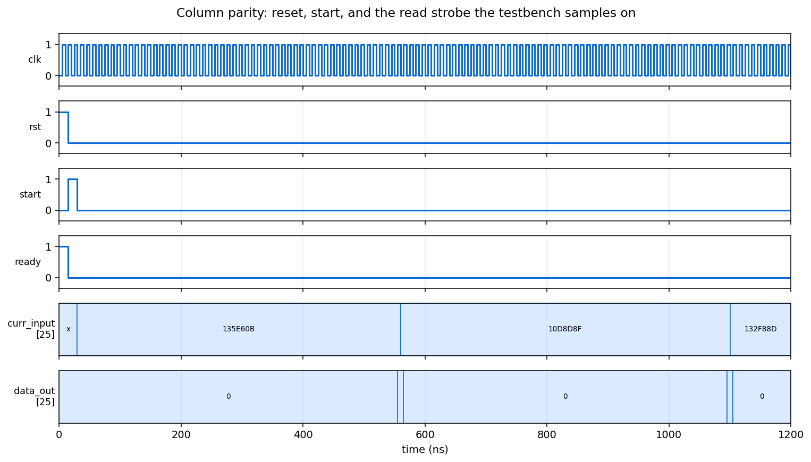

# Column Parity Function

A hardware unit computing column parity across a 64-word memory, built as a
separated controller and datapath and verified against golden vectors.



## Requirements

[Icarus Verilog](https://steveicarus.github.io/iverilog/) and `make`. The design
was originally developed against ModelSim; nothing here depends on it.

## Simulating

```bash
make sim
```

Runs the testbench over three input files. Each holds 64 words of 25 bits, and
the unit is fed each word together with the one before it, wrapping at the start.

```bash
make check
```

Simulates and compares the output against the committed golden vectors, failing
if any differ.

## Verification

Three test files, 64 words each. The simulation reproduces all 192 golden output
words exactly.

| file | vectors | result |
| --- | --- | --- |
| `trunk/sim/file/output_0.txt` | 64 | matches |
| `trunk/sim/file/output_1.txt` | 64 | matches |
| `trunk/sim/file/output_2.txt` | 64 | matches |

## Design

**Datapath** holds the word being processed, the accumulating parity, and two
counters: one stepping through the 25 bit positions of a word, the other through
the 64 words. A single-word memory stores the result between the write and read
states.

**Controller** is a nine-state machine. It loads the current word, walks the bit
positions accumulating parity, loads the previous word and does the same, writes
the combined result to memory, then reads it back and advances to the next word.

| signal | direction | meaning |
| --- | --- | --- |
| `clk`, `rst` | in | Clock and asynchronous reset |
| `start` | in | Pulse to begin |
| `curr_input`, `pre_input` | in | The current word and its predecessor |
| `ready` | out | High in the idle state |
| `co_c64` | out | Carry out of the word counter, marking the last word |
| `out` | out | The 25-bit parity result |

## A note on timing

`out` is driven only while the memory read is asserted, and falls back to zero
otherwise. A testbench cannot sample it after a fixed delay and expect the right
value, because the number of cycles per word depends on the counters. The
testbench here waits for the read strobe and samples on the following clock edge,
which is stable regardless of how long a word takes.

## Project structure

```
trunk/src/hdl/
    colParity_top.v         ties controller and datapath together
    colParity_CU.v          the nine-state controller
    colParity_DP.v          registers, counters, parity accumulation
    colparity_same_matrix.v, colparity_different_matrix.v  the parity logic
    memory.v                single-word store between write and read
    register.v, mux.v, counter.v   building blocks
trunk/sim/
    tb/tb.v                 drives the three test files
    file/input_*.txt        input vectors
    file/output_*.txt       golden output vectors
docs/waveform.png           the figure above
Makefile                    sim, check, clean
```
